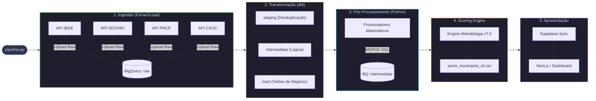

# SolveLicita

**[solvelicita.tech](https://solvelicita.tech)**

</div>

---

[](https://www.python.org/)
[](https://www.getdbt.com/)
[](https://cloud.google.com/bigquery)
[](https://nextjs.org/)
[](https://supabase.com/)
<br>
[](tests/)
[](docs/METODOLOGIA.md)
[](LICENSE)


---

## A pergunta

Municípios brasileiros contratam bilhões em fornecimentos por ano. Mas qual prefeitura tem capacidade real de pagar o que contrata?

Essa pergunta não tem resposta pública, padronizada e acessível. Os dados existem, estão nos sistemas do Tesouro Nacional e de compras públicas. Mas, dispersos em relatórios técnicos que exigem conhecimento contábil para interpretar. O **SolveLicita** atua como um motor de análise de risco fiscal e solvência, cruzando esses dados e os transformando em um único número por município.

---

## O score

Um **Score de Solvência (0–100)** calculado a partir de seis indicadores fiscais públicos, ponderados por relevância:

| Indicador | Fonte | Peso | O que mede |
|---|---|---|---|
| Liquidez Líquida | SICONFI / RGF Anexo 05 | **35%** | Caixa disponível após Restos a Pagar |
| RP Crônicos | SICONFI / RREO Anexo 07 | **15%** | Histórico de dívidas com fornecedores |
| Execução Orçamentária | SICONFI / RREO Anexo 01 | **15%** | Aderência entre receita prevista e realizada |
| Transparência Fiscal | SICONFI | **15%** | Continuidade de entrega de dados públicos |
| Autonomia Tributária | FINBRA / DCA | **10%** | Dependência do FPM vs receita própria |
| Bloqueio Federal | CAUC / STN | **10%** | Pendências que bloqueiam repasses federais |

A fórmula, as curvas de pontuação e as justificativas de cada escolha estão em [`docs/METODOLOGIA.md`](docs/METODOLOGIA.md).

**Classificação:**

| Score | Classificação |
|---|---|
| ≥ 80 | 🟢 Risco Baixo |
| 60 – 79 | 🟡 Risco Médio |
| 40 – 59 | 🔴 Risco Alto |
| < 40 | ⛔ Crítico |
| — | ⚫ Sem Dados |

Além do score numérico, dois caps de classificação operam de forma independente: municípios com histórico de não entrega de dados não podem ser classificados como Risco Baixo, e municípios com padrão crônico de Restos a Pagar Processados têm teto em Risco Médio.

---

## Arquitetura de Dados (Modern Data Stack)

O projeto opera sob o padrão de **Modern Data Stack (MDS)** com processamento híbrido no Google Cloud. O modelo foca em extração massiva e delega a transformação analítica para o banco de dados (BigQuery), enquanto os cálculos matemáticos complexos de avaliação de risco ficam no backend Python.



### Decisões de Design do Pipeline
- **Espinha Dorsal Absoluta (Master Spine):** Municípios inadimplentes em transparência (sem dados) são intencionalmente avaliados como "Sem Dados" e **não** descartados da base. A referência geográfica principal é o IBGE, garantindo que o score seja aplicado consistentemente a todos os entes.
- **Soberania do Dado Declarado:** O modelo analítico baseia-se unicamente nas declarações oficiais dos municípios ao Tesouro Nacional. Não há inferências de valores contábeis.
- **Integração de Frequências Heterogêneas:** O fluxo lida com fontes de diferentes frequências de atualização (diária como CAUC e PNCP, bimestral/quadrimestral como SICONFI e anual como DCA) consolidando-as em uma mesma "janela de liquidez" no dbt (Data Build Tool).
- **Processamento Incremental e Escalável:** Os cálculos são construídos utilizando `MERGE` SQL e estratégias `incremental` no dbt, visando o menor custo computacional no BigQuery e habilitando a execução independente por estado (UF).

---

## Estrutura do Repositório

```text
solvelicita/
├── dbt/                    # Transformação de dados SQL (Data Warehouse)
│   ├── models/             # Camadas: staging, intermediate, mart
│   └── dbt_project.yml     # Configuração do dbt
├── docs/                   # Metodologia, validações de backtest e assets
├── frontend/               # Aplicação Next.js (Visualização de Risco)
├── src/                    # Motor de Coleta e Análise de Risco Fiscal (Python)
│   ├── collectors/         # Clientes de API (SICONFI, CAUC, PNCP)
│   ├── processors/         # Cálculos de indicadores (Pós-processamento dbt)
│   ├── engine/             # Calculadora final do Score (Metodologia)
│   └── analysis/           # Ferramentas de backtest e estatística
├── tests/                  # Testes automatizados (pytest)
└── pipeline.py             # Orquestrador central de ETL e Score
```

---

## Como reproduzir (Desenvolvimento)

**1. Configuração de Ambientes (Isolados):**
```bash
git clone https://github.com/Fel-tby/solvelicita.git
cd solvelicita

# Ambiente Principal (Coleta, Processamento e Score)
python -m venv venv
venv\Scripts\activate        # Windows (ou source venv/bin/activate em Linux/mac)
pip install -r requirements.txt
deactivate

# Ambiente dbt (Transformação SQL)
python -m venv venv_dbt
venv_dbt\Scripts\activate    # Windows
pip install dbt-core dbt-bigquery
deactivate
```

**2. Credenciais:**
- Configure as credenciais do Google Cloud e Supabase no arquivo `.env` (use `.env.example` como base).
- Configure seu `dbt/profiles.yml`.

**3. Execução do Orquestrador:**
O orquestrador `pipeline.py` gerencia as etapas de forma modular e sequencial.

```bash
# Ative o ambiente principal
venv\Scripts\activate

# Rodar o motor de score completo para uma UF
python pipeline.py --uf PB --mode incremental --steps collect,dbt,process,score,sync

# Rodar apenas as transformações de dados e recálculo da engine
python pipeline.py --uf PB --steps dbt,score
```

---

## Documentação e Testes

| Documento | Conteúdo |
|---|---|
| [`docs/METODOLOGIA.md`](docs/METODOLOGIA.md) | Fórmula, pesos, curvas de pontuação, caps duros |
| [`docs/VALIDACAO.md`](docs/VALIDACAO.md) | Backtest, AUC-ROC, análise de sensibilidade |

**Executando Testes:**
```bash
# Camada SQL / BigQuery
venv_dbt\Scripts\activate
cd dbt && dbt test

# Camada Python / Score
venv\Scripts\activate
pytest -v
```

---

## Como citar

> SolveLicita. *Score de Solvência Municipal — Paraíba*. 2026. Disponível em: https://solvelicita.tech. Código e metodologia: https://github.com/Fel-tby/solvelicita.
