<p align="center">
  
</p>

<p align="center">
  <a href="https://www.python.org/"></a>
  <a href="https://www.getdbt.com/"></a>
  <a href="https://cloud.google.com/bigquery"></a>
  <a href="https://supabase.com/"></a>
  <br>
  <a href="tests/"></a>
  <a href="docs/METODOLOGIA.md"></a>
  <a href="LICENSE"></a>
</p>

---

## A pergunta

Municípios brasileiros contratam bilhões em fornecimentos por ano. Mas qual prefeitura tem capacidade real de pagar o que contrata?

Essa pergunta não tem resposta pública, padronizada e acessível. Os dados existem, estão nos sistemas do Tesouro Nacional e de compras públicas. Mas, dispersos em relatórios técnicos que exigem conhecimento contábil para interpretar. O **SolveLicita** atua como um motor de análise de risco fiscal e solvência, cruzando esses dados e os transformando em um único número por município.

---

## O score

Um **Score de Solvência (0–100)** calculado a partir de seis indicadores fiscais públicos, ponderados por relevância:

| Indicador | Fonte | Peso | O que mede |
|---|---|---|---|
| Liquidez Líquida | SICONFI / RGF Anexo 05 | **35%** | Caixa disponível após Restos a Pagar |
| RP Crônicos | SICONFI / RREO Anexo 07 | **15%** | Histórico de dívidas com fornecedores |
| Execução Orçamentária | SICONFI / RREO Anexo 01 | **15%** | Aderência entre receita prevista e realizada |
| Transparência Fiscal | SICONFI | **15%** | Continuidade de entrega de dados públicos |
| Autonomia Tributária | FINBRA / DCA | **10%** | Dependência do FPM vs receita própria |
| Bloqueio Federal | CAUC / STN | **10%** | Pendências que bloqueiam repasses federais |

A fórmula, as curvas de pontuação e as justificativas de cada escolha estão em [`docs/METODOLOGIA.md`](docs/METODOLOGIA.md).

**Classificação:**

| Score | Classificação |
|---|---|
| ≥ 80 | 🟢 Risco Baixo |
| 60 – 79 | 🟡 Risco Médio |
| 40 – 59 | 🔴 Risco Alto |
| < 40 | ⛔ Crítico |
| — | ⚫ Sem Dados |

Além do score numérico, dois caps de classificação operam de forma independente: municípios com histórico de não entrega de dados não podem ser classificados como Risco Baixo, e municípios com padrão crônico de Restos a Pagar Processados têm teto em Risco Médio.

---

## Validação empírica

A metodologia foi validada por backtest walk-forward: o score é calculado em um ano e comparado com o comportamento fiscal observado no ano seguinte, usando a ocorrência futura de Restos a Pagar crônicos como desfecho.

Na validação geral documentada, o modelo operacional apresentou:

| Métrica | Resultado |
|---|---:|
| Pares município-ano avaliados | **4.671** |
| AUC-ROC | **0.7443** |
| Spearman | **-0.3827** |

O teste sem o componente `RPproc` também preserva discriminação acima do acaso, o que indica que o modelo não depende de uma única variável para ordenar risco. Resultados, limitações e testes de sensibilidade estão em [`docs/VALIDACAO.md`](docs/VALIDACAO.md).

---

## Arquitetura do pipeline

O SolveLicita opera com um fluxo **BigQuery-first**. Os dados públicos são coletados das APIs oficiais, publicados na camada `raw`, estruturados com `dbt`, enriquecidos por pós-processadores Python e consolidados pela engine de score. O resultado pode ser exportado localmente, publicado em snapshots históricos no BigQuery e sincronizado no Supabase para consumo público.

```mermaid
flowchart LR
    PL(["pipeline.py"])

    subgraph INGEST ["1. Ingestão"]
        direction LR
        APIS["APIs públicas<br/>IBGE / SICONFI / DCA / CAUC / PNCP"]
        RAW[("BigQuery raw")]
        APIS --> RAW
    end

    subgraph TRANSFORM ["2. Transformação"]
        direction TB
        DBT["dbt"]
        STG["staging"]
        INT["intermediate"]
        MART["mart"]
        DBT --> STG --> INT --> MART
    end

    subgraph ENRICH ["3. Enriquecimento"]
        direction TB
        PROC["Postprocessors Python"]
        BQINT[("BigQuery intermediate")]
        PROC -->|MERGE SQL| BQINT
    end

    subgraph SCORE ["4. Score"]
        direction LR
        ENG["Engine v7.0"]
        CSV["CSV final"]
    end

    subgraph PUBLISH ["5. Publicação"]
        direction LR
        SNAP[("BigQuery snapshots")]
        SB[("Supabase")]
        WEB["Aplicação web"]
    end

    PL --> INGEST
    RAW --> TRANSFORM
    MART --> ENRICH
    MART --> ENG
    BQINT --> ENG
    ENG --> SNAP
    ENG --> CSV
    CSV --> SB
    SB -. consumo público .-> WEB

    style PL fill:#0f2744,color:#e8f3ff,stroke:#7fc4ff,stroke-width:2px
    style INGEST fill:#12263d,color:#e8f3ff,stroke:#185FA5,stroke-width:2px
    style TRANSFORM fill:#12263d,color:#e8f3ff,stroke:#2B7BBB,stroke-width:2px
    style ENRICH fill:#12263d,color:#e8f3ff,stroke:#4A97D9,stroke-width:2px
    style SCORE fill:#12263d,color:#e8f3ff,stroke:#6FB4F0,stroke-width:2px
    style PUBLISH fill:#12263d,color:#e8f3ff,stroke:#91CBFF,stroke-width:2px

    style APIS fill:#1a1f26,color:#f2f7ff,stroke:#8aa7c4,stroke-width:1px
    style RAW fill:#1a1f26,color:#f2f7ff,stroke:#8aa7c4,stroke-width:1px
    style DBT fill:#1a1f26,color:#f2f7ff,stroke:#8aa7c4,stroke-width:1px
    style STG fill:#1a1f26,color:#f2f7ff,stroke:#8aa7c4,stroke-width:1px
    style INT fill:#1a1f26,color:#f2f7ff,stroke:#8aa7c4,stroke-width:1px
    style MART fill:#1a1f26,color:#f2f7ff,stroke:#8aa7c4,stroke-width:1px
    style PROC fill:#1a1f26,color:#f2f7ff,stroke:#8aa7c4,stroke-width:1px
    style BQINT fill:#1a1f26,color:#f2f7ff,stroke:#8aa7c4,stroke-width:1px
    style ENG fill:#1a1f26,color:#f2f7ff,stroke:#8aa7c4,stroke-width:1px
    style CSV fill:#1a1f26,color:#f2f7ff,stroke:#8aa7c4,stroke-width:1px
    style SNAP fill:#1a1f26,color:#f2f7ff,stroke:#8aa7c4,stroke-width:1px
    style SB fill:#1a1f26,color:#f2f7ff,stroke:#8aa7c4,stroke-width:1px
    style WEB fill:#1a1f26,color:#f2f7ff,stroke:#8aa7c4,stroke-width:1px
```



Cada camada tem uma responsabilidade distinta:

- `raw`: dados oficiais coletados sem interpretação analítica.
- `staging`, `intermediate` e `mart`: modelagem e consolidação com `dbt`.
- `processors`: regras complementares em Python.
- `engine`: cálculo final do score e classificação de risco.
- `Supabase`: camada pública consumida pela aplicação web.

---

## Estrutura do repositório

```text
solvelicita/
├── dbt/                    # Transformação SQL no data warehouse
│   ├── models/             # Camadas staging, intermediate e mart
│   └── dbt_project.yml     # Configuração do projeto dbt
├── docs/                   # Metodologia, validação e assets
├── src/                    # Motor Python de coleta, processamento e score
│   ├── collectors/         # Clientes de APIs públicas
│   ├── processors/         # Pós-processamento analítico
│   ├── engine/             # Cálculo final do score
│   ├── scorers/            # Curvas, pesos e pontuações parciais
│   ├── jobs/               # Orquestração testável do pipeline
│   └── analysis/           # Backtests e análises estatísticas
├── tests/                  # Testes automatizados
└── pipeline.py             # CLI principal do pipeline
```

---

## Reprodutibilidade

O pipeline pode ser reproduzido com dois ambientes isolados: um para coleta, processamento e score em Python; outro para transformação SQL com `dbt`.

```bash
git clone https://github.com/Fel-tby/solvelicita.git
cd solvelicita

# Ambiente principal
python -m venv venv
venv\Scripts\activate
pip install -r requirements.txt
deactivate

# Ambiente dbt
python -m venv venv_dbt
venv_dbt\Scripts\activate
pip install dbt-core dbt-bigquery
deactivate
```

Configure as credenciais de Google Cloud e Supabase no arquivo `.env`, usando [`.env.example`](.env.example) como referência. Configure também o perfil dbt a partir de [`dbt/profiles.yml.example`](dbt/profiles.yml.example).

Execução principal:

```bash
venv\Scripts\activate
python pipeline.py --uf PB --mode incremental --steps collect,dbt,process,score,sync
```

Execução parcial, quando os dados já foram coletados e transformados:

```bash
python pipeline.py --uf PB --steps process,score,sync
```

---

## Documentação e Testes

| Documento | Conteúdo |
|---|---|
| [`docs/METODOLOGIA.md`](docs/METODOLOGIA.md) | Fórmula, pesos, curvas de pontuação, caps duros |
| [`docs/VALIDACAO.md`](docs/VALIDACAO.md) | Backtest, AUC-ROC, análise de sensibilidade |

**Executando Testes:**
```bash
# Camada SQL / BigQuery
venv_dbt\Scripts\activate
cd dbt && dbt test

# Camada Python / Score
venv\Scripts\activate
pytest -v
```
