<p align="center">
  
</p>

<p align="center">
  <a href="https://www.python.org/"></a>
  <a href="https://www.getdbt.com/"></a>
  <a href="https://cloud.google.com/bigquery"></a>
  <a href="https://nextjs.org/"></a>
  <a href="https://supabase.com/"></a>
  <br>
  <a href="tests/"></a>
  <a href="docs/METODOLOGIA.md"></a>
  <a href="LICENSE"></a>
</p>

---

## A pergunta

Municípios brasileiros contratam bilhões em fornecimentos por ano. Mas qual prefeitura tem capacidade real de pagar o que contrata?

Essa pergunta não tem resposta pública, padronizada e acessível. Os dados existem, estão nos sistemas do Tesouro Nacional e de compras públicas. Mas, dispersos em relatórios técnicos que exigem conhecimento contábil para interpretar. O **SolveLicita** atua como um motor de análise de risco fiscal e solvência, cruzando esses dados e os transformando em um único número por município.

---

## O score

Um **Score de Solvência (0–100)** calculado a partir de seis indicadores fiscais públicos, ponderados por relevância:

| Indicador | Fonte | Peso | O que mede |
|---|---|---|---|
| Liquidez Líquida | SICONFI / RGF Anexo 05 | **35%** | Caixa disponível após Restos a Pagar |
| RP Crônicos | SICONFI / RREO Anexo 07 | **15%** | Histórico de dívidas com fornecedores |
| Execução Orçamentária | SICONFI / RREO Anexo 01 | **15%** | Aderência entre receita prevista e realizada |
| Transparência Fiscal | SICONFI | **15%** | Continuidade de entrega de dados públicos |
| Autonomia Tributária | FINBRA / DCA | **10%** | Dependência do FPM vs receita própria |
| Bloqueio Federal | CAUC / STN | **10%** | Pendências que bloqueiam repasses federais |

A fórmula, as curvas de pontuação e as justificativas de cada escolha estão em [`docs/METODOLOGIA.md`](docs/METODOLOGIA.md).

**Classificação:**

| Score | Classificação |
|---|---|
| ≥ 80 | 🟢 Risco Baixo |
| 60 – 79 | 🟡 Risco Médio |
| 40 – 59 | 🔴 Risco Alto |
| < 40 | ⛔ Crítico |
| — | ⚫ Sem Dados |

Além do score numérico, dois caps de classificação operam de forma independente: municípios com histórico de não entrega de dados não podem ser classificados como Risco Baixo, e municípios com padrão crônico de Restos a Pagar Processados têm teto em Risco Médio.

---

## Arquitetura do Pipeline

O SolveLicita opera hoje com um fluxo **BigQuery-first**. Os dados públicos são coletados das APIs oficiais, publicados na camada `raw`, estruturados com `dbt`, enriquecidos por pós-processadores Python e consolidados pela engine de score. Ao final, o resultado é exportado localmente, sincronizado com o Supabase e também pode ser publicado na camada temporal do BigQuery para histórico e análises futuras.

```mermaid
flowchart LR
    PL(["pipeline.py"])

    subgraph INGEST ["1. Ingestão"]
        direction LR
        APIS["APIs públicas<br/>IBGE / SICONFI / DCA / CAUC / PNCP"]
        RAW[("BigQuery raw")]
        APIS --> RAW
    end

    subgraph TRANSFORM ["2. Transformação (dbt)"]
        direction TB
        DBT["dbt"]
        STG["staging"]
        INT["intermediate"]
        MART["mart"]
        DBT --> STG --> INT --> MART
    end

    subgraph ENRICH ["3. Pós-Processamento (Python)"]
        direction TB
        PROC["Postprocessors Python"]
        BQINT[("BQ intermediate")]
        PROC -->|MERGE SQL| BQINT
    end

    subgraph SCORE ["4. Scoring Engine"]
        direction LR
        ENG["Engine de score v7.0"]
        CSV["CSV final"]
    end

    subgraph PRESENT ["5. Apresentação"]
        direction LR
        SNAP[("BigQuery snapshots / ml / analytics")]
        SB[("Supabase")]
        WEB["Frontend Next.js"]
    end

    PL --> INGEST
    RAW --> TRANSFORM
    MART --> ENRICH
    MART --> ENG
    BQINT --> ENG
    ENG --> SNAP
    ENG --> CSV
    CSV --> SB
    SB --> WEB

    style PL fill:#0f2744,color:#e8f3ff,stroke:#7fc4ff,stroke-width:2px
    style INGEST fill:#12263d,color:#e8f3ff,stroke:#185FA5,stroke-width:2px
    style TRANSFORM fill:#12263d,color:#e8f3ff,stroke:#2B7BBB,stroke-width:2px
    style ENRICH fill:#12263d,color:#e8f3ff,stroke:#4A97D9,stroke-width:2px
    style SCORE fill:#12263d,color:#e8f3ff,stroke:#6FB4F0,stroke-width:2px
    style PRESENT fill:#12263d,color:#e8f3ff,stroke:#91CBFF,stroke-width:2px

    style APIS fill:#1a1f26,color:#f2f7ff,stroke:#8aa7c4,stroke-width:1px
    style RAW fill:#1a1f26,color:#f2f7ff,stroke:#8aa7c4,stroke-width:1px
    style DBT fill:#1a1f26,color:#f2f7ff,stroke:#8aa7c4,stroke-width:1px
    style STG fill:#1a1f26,color:#f2f7ff,stroke:#8aa7c4,stroke-width:1px
    style INT fill:#1a1f26,color:#f2f7ff,stroke:#8aa7c4,stroke-width:1px
    style MART fill:#1a1f26,color:#f2f7ff,stroke:#8aa7c4,stroke-width:1px
    style PROC fill:#1a1f26,color:#f2f7ff,stroke:#8aa7c4,stroke-width:1px
    style BQINT fill:#1a1f26,color:#f2f7ff,stroke:#8aa7c4,stroke-width:1px
    style ENG fill:#1a1f26,color:#f2f7ff,stroke:#8aa7c4,stroke-width:1px
    style CSV fill:#1a1f26,color:#f2f7ff,stroke:#8aa7c4,stroke-width:1px
    style SNAP fill:#1a1f26,color:#f2f7ff,stroke:#8aa7c4,stroke-width:1px
    style SB fill:#1a1f26,color:#f2f7ff,stroke:#8aa7c4,stroke-width:1px
    style WEB fill:#1a1f26,color:#f2f7ff,stroke:#8aa7c4,stroke-width:1px
```



### Decisões de Design do Pipeline
- **Base territorial completa:** todos os municípios permanecem na base, inclusive os classificados como `Sem Dados`.
- **Dados declarados:** o score usa apenas informações públicas declaradas aos sistemas oficiais, sem imputação contábil.
- **Fluxo operacional atual:** o BigQuery é a fonte analítica principal; `municipios`, `CAUC`, `SICONFI` e `DCA` já publicam raw direto no BQ com carga segura, enquanto `PNCP` ainda usa checkpoint local durante a coleta.

---

## Estrutura do Repositório

```text
solvelicita/
├── dbt/                    # Transformação de dados SQL (Data Warehouse)
│   ├── models/             # Camadas: staging, intermediate, mart
│   └── dbt_project.yml     # Configuração do dbt
├── docs/                   # Metodologia, validações de backtest e assets
├── frontend/               # Aplicação Next.js (Visualização de Risco)
├── src/                    # Motor de Coleta e Análise de Risco Fiscal (Python)
│   ├── collectors/         # Clientes de API (SICONFI, CAUC, PNCP)
│   ├── processors/         # Cálculos de indicadores (Pós-processamento dbt)
│   ├── engine/             # Calculadora final do Score (Metodologia)
│   └── analysis/           # Ferramentas de backtest e estatística
├── tests/                  # Testes automatizados (pytest)
└── pipeline.py             # Orquestrador central de ETL e Score
```

---

## Como reproduzir (Desenvolvimento)

**1. Configuração de Ambientes (Isolados):**
```bash
git clone https://github.com/Fel-tby/solvelicita.git
cd solvelicita

# Ambiente Principal (Coleta, Processamento e Score)
python -m venv venv
venv\Scripts\activate        # Windows (ou source venv/bin/activate em Linux/mac)
pip install -r requirements.txt
deactivate

# Ambiente dbt (Transformação SQL)
python -m venv venv_dbt
venv_dbt\Scripts\activate    # Windows
pip install dbt-core dbt-bigquery
deactivate
```

**2. Credenciais:**
- Configure as credenciais do Google Cloud e Supabase no arquivo `.env`.
- Configure seu `dbt/profiles.yml` a partir de [`dbt/profiles.yml.example`](dbt/profiles.yml.example).
- Para o frontend, configure `frontend/.env.local` a partir de [`frontend/.env.local.example`](frontend/.env.local.example).

**3. Execução do Orquestrador:**
O orquestrador `pipeline.py` gerencia as etapas de forma modular e sequencial.

```bash
# Ative o ambiente principal
venv\Scripts\activate

# Rodar o motor de score completo para uma UF
python pipeline.py --uf PB --mode incremental --steps collect,dbt,process,score,sync

# Rodar coleta + transformação + recalcular score sem sync
python pipeline.py --uf PB --mode incremental --steps collect,dbt,process,score

# Rodar apenas etapas finais com dados já preparados
python pipeline.py --uf PB --steps process,score,sync

# Rodar CAUC diário para todo o Nordeste, sem prompts
python pipeline.py --uf ALL --mode incremental --steps collect,dbt,process,score,sync --collectors cauc --yes

# Rodar incrementais semanais dos demais coletores no Nordeste
python pipeline.py --uf ALL --mode incremental --steps collect,dbt,process,score,sync --collectors siconfi,dca,pncp --yes
```

**Observação sobre `--uf ALL`:**
- sem `collect`, ele aceita apenas `process`, `score` e `sync`
- com `collect` e sem `--collectors`, preserva o modo legado `CAUC-only`
- com `collect` e `--collectors`, vira um `ALL` real para as UFs oficiais do Nordeste (`AL, BA, CE, MA, PB, PE, PI, RN, SE`)
- UFs fora desse conjunto, como `MG`, são ignoradas no modo coletivo

---

## Documentação e Testes

| Documento | Conteúdo |
|---|---|
| [`docs/METODOLOGIA.md`](docs/METODOLOGIA.md) | Fórmula, pesos, curvas de pontuação, caps duros |
| [`docs/VALIDACAO.md`](docs/VALIDACAO.md) | Backtest, AUC-ROC, análise de sensibilidade |

**Executando Testes:**
```bash
# Camada SQL / BigQuery
venv_dbt\Scripts\activate
cd dbt && dbt test

# Camada Python / Score
venv\Scripts\activate
pytest -v
```

---

## Como citar

> SolveLicita. *Score de Solvência Municipal*. 2026. Disponível em: https://solvelicita.tech. Código, metodologia e validação: https://github.com/Fel-tby/solvelicita.
